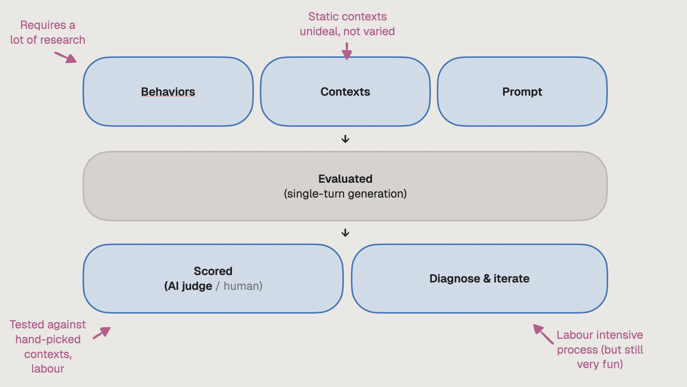
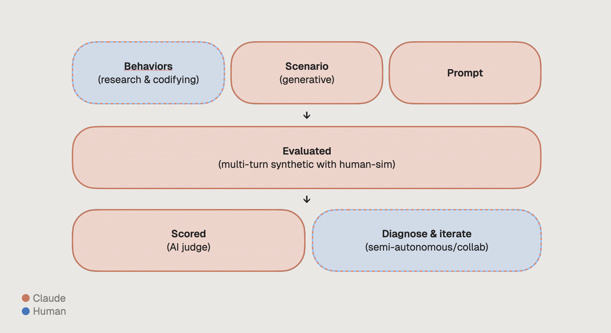

## Problem

How do you teach a model a new skill or behaviour? You could prompt "Be a pirate!"  in a system prompt and you get "ahoy, what's on your mind?" Easy!

"Be proactive" or "Know when to push back" are more ambiguous, need to be broken down, defined, and evaluated consistently so they work at scale across all the different kinds of conversations a model encounters. 

That's the core problem Soulcraft attacks: taking a vague human intention like "be proactive" and turning it into something measurable, testable, and improvable.

## Industry convention for evals

The typical eval flow looks something like this:

1. Humans define the behaviours they want to test
2. Humans write (or pull from prod) a fixed set of test contexts
3. Humans develop a prompt
4. The prompt is evaluated, usually against a single-turn generation
5. An AI judge or human judge scores the response
6. Someone diagnoses what went wrong and iterates on the prompt

People are involved at every stage. That's a lot of problems stacking up.

Defining behaviours and taxonomising them requires deep research. Static test contexts take time to create, don't test multi-turn conversations or tool calling, and are hard to scale. The judge itself requires careful development (and its own set of contexts to validate against). Diagnosing failures requires reading transcripts and pattern-matching across them, which is labour intensive. And behaviours trade off each other at scale: optimising for kindness may cost conciseness, optimising for depth may cost brevity. Blindly climbing every score to 10/10 doesn't work. You need judgment about the balance.

There are various solutions like Promptfoo that tackle parts of this. But let's try to arrive at a solution through first principles!

## What's new since 2025

Since Opus 4.0, Claude can:

* **Do deep research** on topics and come to informed, synthesised conclusions
* **Operate autonomously** for hours, running commands, maintaining large files, debugging creatively
* **Take on ambiguous goals** and accomplish them across long context. You can give it a vision and it will try to achieve that vision
* **Prompt itself.** This is the big one. Claude is way better at writing prompts, especially when powered by a skill

So instead of humans doing the labour with AI doing small tasks... let's flip it. AI does the craft and iteration. Humans focus on what they're best at: intuition, editorial stance, and vision for what they want to create.

## Soulcraft

This repo helps prompt engineers develop behaviours for SOTA models through editorial collaboration; where humans are the editors and AI is the collaborator.

1. **Claude and people collaborate on behaviours.** Claude researches the concept (e.g. "proactivity"), breaks it into measurable dimensions, and writes the scorer criteria. People provide editorial guidance and align its work to their vision.
   - Behaviour YAMLs live in each project's `behaviors/` dir (e.g. [`evals/test-ai/behaviors/`](../evals/test-ai/behaviors/))
   - You set a config `soulcraft.yaml` in each project root
   - The soulcraft skill that drives the loop: [`.claude/skills/soulcraft/SKILL.md`](../soulcraft-claude/.claude/skills/soulcraft/SKILL.md)
2. **Claude generates chat scenarios.** Instead of baked, static contexts, scenarios are infinitely generative.
3. **Claude runs evals.** Each scenario becomes a multi-turn conversation between an AI simulating a human ⇋ the target AI, scored by the AI judge.
   - Human simulator prompt: [`prompts/evaluator.md`](../prompts/evaluator.md)   
4. **Claude diagnoses.** It reads the transcripts alongside scores identifying patterns. Is it the prompt? The scorer? It doesn't blindly optimise for a 10/10, but is expected to balance variables toward the people's cohesive vision.
5. **Claude iterates.** It edits the prompt, updates the scorer, or generates new scenarios. Then runs again in an iterative loop autonomously for hours or days.
   - Target prompt lives at `prompt.md` in each project (e.g. [`evals/test-ai/prompt.md`](../evals/test-ai/prompt.md))
   - Prompt-writing principles that guide diagnosis: [`.claude/skills/prompt-writing/SKILL.md`](../soulcraft-claude/.claude/skills/prompt-writing/SKILL.md)
6. **People edit.** They see the results, read highlighted transcripts, spot errors the AI missed, and steer the direction. Claude can bring people in by opening up a Terminal UI of problematic transcripts, directing people's attention.
   - TUI: [`tui/`](../tui/) — Ink.js app for browsing transcripts, scores, and judge reasoning

The whole loop is autonomous or semi-autonomous depending on how involved you want to be.

### Built on Bloom

Anthropic's Bloom framework was a great evaluation engine to use as a base. Bloom handles multi-turn scenario generation and scoring across models at scale. Soulcraft adds a prompt-writing agent taught to iterate on the system prompts, a human simulator that generates realistic multi-turn conversations, the agentic loop where Claude diagnoses failures across transcripts, decides what to change (prompt, scorer, or scenarios), a Terminal UI to visually display results.

## Design principles

**Activate AI's agency.** Give Claude a long-term vision and empower it to be autonomous. Help it develop its judgment calls for ambiguous situations alongside a standardised process to follow.

**Judge scores are signals, not truth.** Behaviours compete at scale. A kind AI may be less concise. A research-heavy AI may be more verbose. Blindly climbing both to 10/10 might not be the solution. Instead we use scores as first-pass indicators and encourage Claude to deep-dive the transcripts, pattern-match, and resolve contradictions to the vision the humans set up front.

**Orientation over rules.** In my experience prompting Claude, system prompting intentionality, character, or values produces better generalisation than spelling out explicit rules. Orientation gives it something to reason _from_.

**The human stays in the seat.** Not for labour. For editorial taste and vision. Humans review the interesting transcripts, spot the subtlest errors, steer the behaviours. Claude does the heavy lifting of converting human guidnace into scores, prompts, and scenarios.

## The human simulator

To evaluate at scale, we need conversations of 10–100 turns, calling tools, with humans acting as prod-looking-human as possible. Conventionally this is done with many contractors at places like Scale AI. Simulating a human with an AI allows us to evaluate more consistently, cheaper, faster, and iteratively. I'm quite proud of the place this [human-sim prompt](https://github.com/pistachiomatt/soulcraft-claude/blob/master/prompts/evaluator.md) has landed!

A common challenge with human-simming is the AI continues to act like an assistant: too cooperative, too clean in articulation, doesn't leave most things in subtext, too quickly capitulates to challenges. This is likely because the assistant persona is the dominant persona from post-training. The huamn-sim prompt tries to shift the model out of that mode by:

1. **Chain-of-thought as roleplay.** Its thinking is enforced to a stream-of-consciousness-style roleplay. This, I think, increases the probability it matches the human text in its training data over its trained analytical CoT.

2. **Build a full character + subtext.** It creates a whole character in its first thinking turn: their world, life, voice, and personal drive. When responding to an AI turn, it must "update" this character ensuring its response is consistent with the character's momentum. It's also taught "subtext", to maintain its character and agenda but only reveal 20% of it in actual words (this is how people often speak.)

3. **Anti-patterns.** The `<never>` section in the prompt lists where the assistant distribution is strongest and disallows or redirects that behaviour.

Fun fact: the human simulator was developed by Claude using the Soulcraft repo itself!

## What I'd Improve

If I had more time, there are several things I'd want to develop:

* **Eval each stage of the loop.** Does Claude iterating on the prompt actually converge to a better solution, especially when competing with multiple behaviours?
* **Measure agency more numerically.** When does Claude get stuck? When does it encounter contradictions? I'd like to track this
* **Test generalisation.** Does this framework work for code-gen too? Early testing indicates it does (since it can call arbitrary tools, and those get judged.)
* **Behaviour conflict detection.** Automatically surface when two behaviours are fighting each other, and help the human make the tradeoff
* **Production data integration.** Anonymised real conversations as scenario seeds
* **User group testing.** Create a prompt through this process, then test it with real users to see if they respond differently
